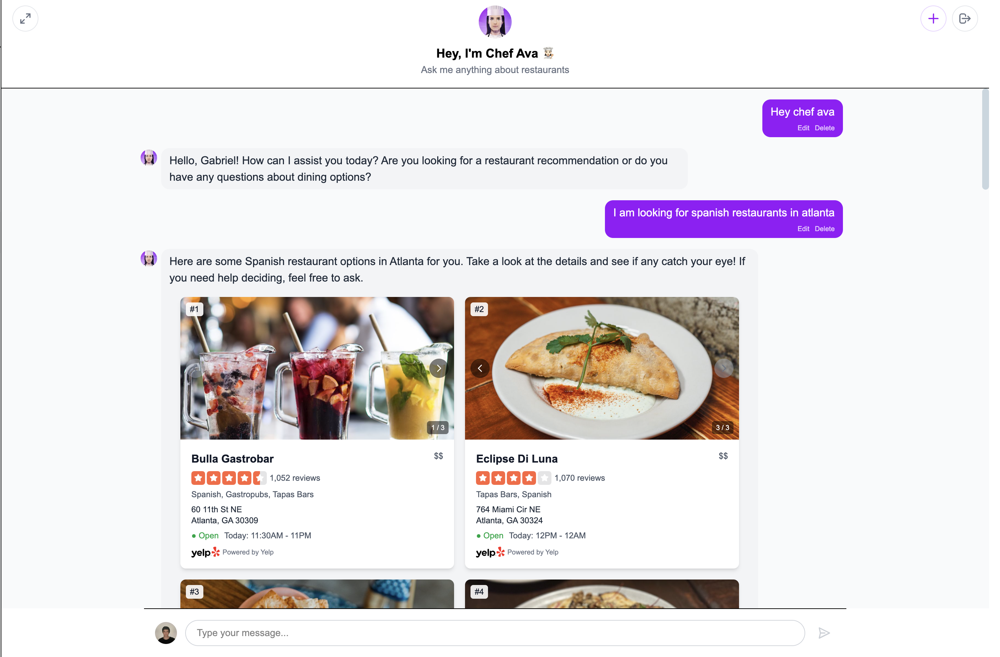

# AI Restaurant Assistant

A modern, full-stack restaurant discovery assistant powered by AI. Built with React, TypeScript, FastAPI, and OpenAI's GPT-4o, this application helps users find and explore restaurants through an intuitive chat interface.

## 📸 Images

<div align="center">
  
  <p><em>Main chat interface with Chef Ava</em></p>
</div>
</br>
<div align="center">
  
  <p><em>Multiple restaurant recommendations with detailed information</em></p>
</div>
</br>
<div align="center">
  
  <p><em>Multi-conversation management</em></p>
</div>


## 🌟 Key Features

### Intelligent Restaurant Discovery
- Personal AI-powered restaurant assistant (Chef Ava) that understands natural language queries
- Detailed restaurant information including photos, ratings, reviews, hours, and pricing
- Integration with Yelp's API for comprehensive and up-to-date restaurant data
- Visual restaurant cards with multiple photos and interactive navigation

### Multi-Conversation Management
- Support for creation of different conversations
- Conversation sidebar for easy navigation between chats
- Auto-saving conversations
- Ability to delete or switch between conversations
- Conversation persistence across sessions

### User Authentication & Personalization
- Google account integration for secure authentication
- Personal conversation history tied to user accounts
- Separate conversation spaces for different users
- Profile picture and name integration from Google account

### Chat Features
- Real-time streaming responses
- Message editing and deletion capabilities
- Fullscreen mode for better visibility
- Minimizable chat widget
- Markdown support in responses

## 🛠️ Tech Stack

### Frontend
- React 18 with TypeScript
- TailwindCSS
- Google OAuth

### Backend
- Python 3.11+
- FastAPI
- SQLite
- OpenAI API
- Yelp Fusion API

## 🚀 Getting Started

### Prerequisites
- Node.js 18+
- Python 3.11+
- pip
- OpenAI API key
- Google OAuth credentials
- Yelp API key

### Environment Setup

Create a `.env` file in the backend directory with:
```
OPENAI_API_KEY=your_openai_api_key
GOOGLE_CLIENT_ID=your_google_client_id
YELP_API_KEY=your_yelp_api_key
```

### Installation

1. Clone the repository:
```bash
git clone https://github.com/yourusername/restaurant-assistant.git
cd restaurant-assistant
```

2. Setup Backend:
```bash
cd backend
pip install -r requirements.txt
uvicorn app.main:app --reload
```

3. Create your .env file in the backend directory:
```bash
# backend/.env
touch .env
```

4. Add API keys inside .env file:
```bash
OPENAI_API_KEY=your_openai_key
GOOGLE_CLIENT_ID=your_google_client_id
YELP_API_KEY=your_yelp_api_key
```

5. In a new termial - Setup Frontend:
```bash
cd frontend
npm install
npm run dev
```

The application will be available at:
- Frontend: http://localhost:5173
- Backend: http://localhost:8000
- API Docs: http://localhost:8000/docs

## 🔒 Security Features

- Google OAuth2 authentication
- CORS protection

## 📚 API Documentation

### Key Endpoints

#### Authentication
- `POST /api/auth/google-login`: Google OAuth login

#### Messages
- `POST /api/messages/stream`: Stream chat messages
- `PUT /api/messages/{message_id}`: Update message
- `DELETE /api/messages/{message_id}`: Delete message

#### Conversations
- `GET /api/messages/conversations`: Get user conversations
- `POST /api/messages/new-conversation`: Create new conversation
- `DELETE /api/messages/conversations/{conversation_id}`: Delete conversation

#### Restaurant Search
- `GET /api/yelp/businesses/search`: Search restaurants
- `GET /api/yelp/businesses/{business_id}`: Get business details

Full API documentation is available at `/docs` when running the backend server.

## 👨‍💻 Contributors
- Gabriel Mendonca (gmunhoz0810) -> [GitHub](https://github.com/gmunhoz0810) | [LinkedIn](https://www.linkedin.com/in/gabriel-m-mendonca/)